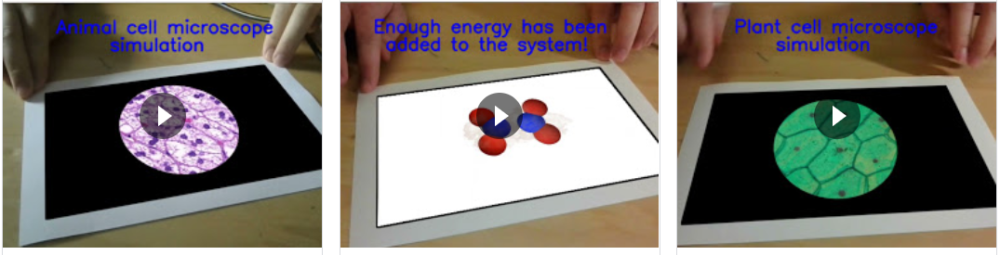
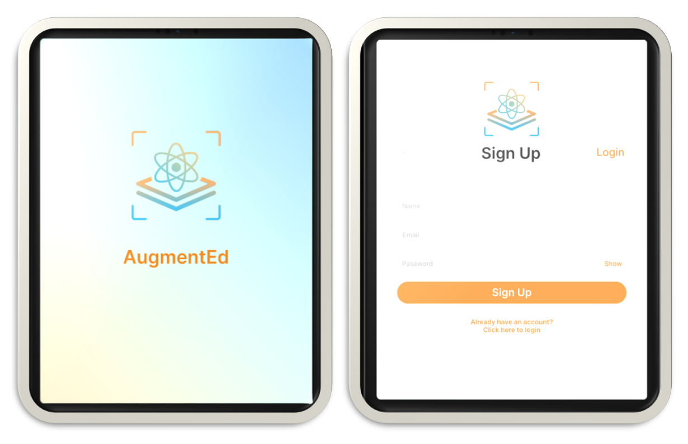
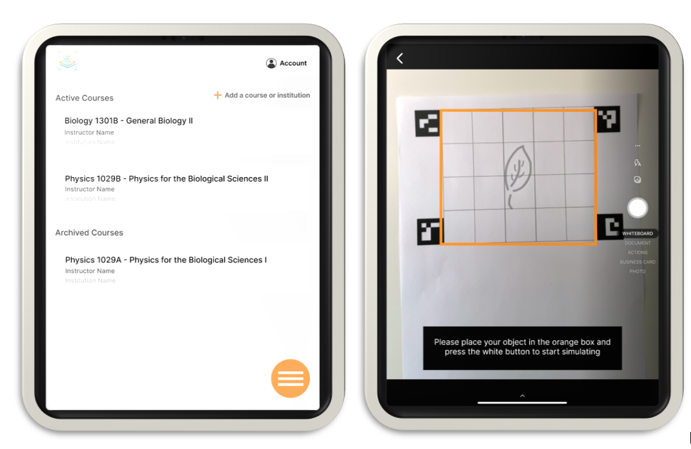

With AugmentEd, our goal is to provide students, and institutions with an accessible, affordable, and interactive way of learning. [Video demo here](https://youtu.be/hXH4LOHEFIQ)



## What is AugmentedEd?

A fun, interactive educational tool that projects virtual simulations of science experiments onto your sheet of paper using only your camera, a printer, and paper!

AugmentEd is an educational tool that projects virtual simulations of science experiments right in front of you. All the user needs to do is draw a picture representing what type of experiment they want to visualize, and AugmentEd will project a simulation directly on the sheet of paper the picture is drawn on. This will enable students to visualize concepts such as tectonic plate movement or circuits right from the comfort of their home. The only materials required are a printer, camera, and paper!


## How does it work?

- Draw a picture of the experiment you want to visualize on paper. 
- A pre-trained machine learning model identifiess the drawing based on a trained MobileNetv2 Network
- A virtual 3D model of the experiment is rendered and animated 
- The animation is projected onto your piece of paper








## Backend

```
AugmentEd ────────computer-vision
                │           ├─./img
                │           ├─./imgsearch   
                │           │         │─ __init__.py
                │           │         │─ aug_reality.py
                │           │         │─ __pycache__
                │           │
                │           │
                │           └─ ./sim model
                │           │         │  
                │           │         │─./saved_model
                │           │         │─ label.txt
                │           │
                │           │
                │           └─ ./videos
                │           │      
                │           │       
                │           │             
                │           │    
                │           │─ simulation_classifier.py  
                │           └─  vision.py   
                │ 
                │──── machine-learning
                │           │
                │           │
                │           └─ ./sim model
                │           │         │  
                │           │         │─./saved_model
                │           │         └─  label.txt
                │           │
                │           │
                │           └─ imagetaker.py
                │           │  
                │           └─ simulation_classifier.ipynb         
                │           │             
                │           │    
                │           │─ SimulationClassifierTest.ipynb  
                │
                └────good copy tracker.pdf

   
```

### Computer Vision
```
./computer-vision/vision.py 
```

AugmentEd is written exclusively in python using the OpenCV library. `vision.py` starts by detecting the images on the piece of paper. The frame is analysed by the ML model.
Once identified, a simulation is selected for the drawing provided. In order to render the animation corrrectly, the aruco markers are identified, and their coordinates are utilised to generate a geometrical projection also known as homography.

This process is found in the `find_and_warp()` function imported from `aug_reality.py`
 
#### Aruco Tracker

AugmentEd uses [Aruco Markers](https://docs.opencv.org/master/d5/dae/tutorial_aruco_detection.html) to identify the correspondence between the real environment coordinates and projection of science simulations (or experiments). For this project aruco markers were generated via `dictionary = cv.aruco.Dictionary_get(cv.aruco.DICT_4X4_50)` 


The markers are detected in `vision.py`:
```
33      print("[INFO] initializing marker detector...")
34      arucoDict = cv2.aruco.Dictionary_get(cv2.aruco.DICT_4X4_50)
35      arucoParams = cv2.aruco.DetectorParameters_create()
36      print("[INFO] accessing video stream...")
```

and depending on which simulation is identified by MobileNet, an animation is rendered on the piece of paper. 
To achieve this, we made use of projective geometry, in particular homography.  A geometrical transformation that preserve the structure of the source by ensuriing its map remains unchanged.

#### Homography

Homography is an isomorphism, i.e. a transformation of projective space, that allows us to project from a surface to the other by preserving its map. To achive this we have use

### Image Classification using MobileNetv2

AugmentEd uses image classification to identify pictures and triggers `vision.py` that will then render the correct virtual simulation on the piece of paper.

``` Results of the trained model ```

``` Pre-processing images to be identified ```


