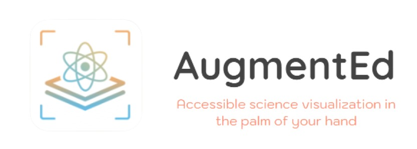
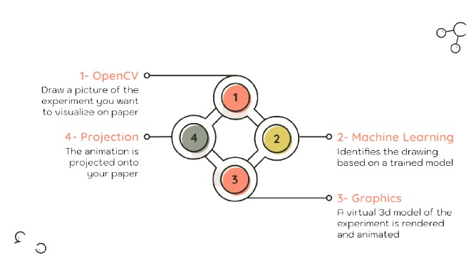
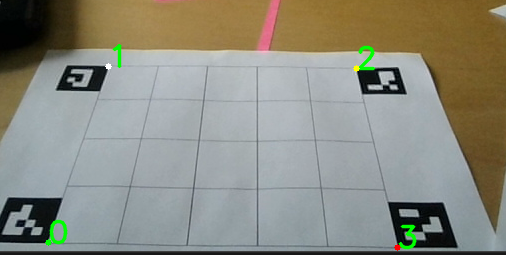

With AugmentEd, our goal is to provide students, and institutions with an accessible, affordable, and interactive way of learning.

## What is it?

A fun, interactive educational tool that projects virtual simulations of science experiments onto your sheet of paper
Using only your camera, a printer, and paper!


## How does it work?

- Draw a picture of the experiment you want to visualize on paper. 
- A pre-trained machine learning model identifiess the drawing based on a trained MobileNetv2 Network
- A virtual 3D model of the experiment is rendered and animated 
- The animation is projected onto your piece of paper




## Backend

```
AugmentEd ────────computer-vision
                │           ├─./img
                │           ├─./imgsearch   
                │           │         │─ __init__.py
                │           │         │─ aug_reality.py
                │           │         │─ __pycache__
                │           │
                │           │
                │           └─ ./sim model
                │           │         │  
                │           │         │─./saved_model
                │           │         │─ label.txt
                │           │
                │           │
                │           └─ ./videos
                │           │      
                │           │       
                │           │             
                │           │    
                │           │─ simulation_classifier.py  
                │           └─  vision.py   
                │ 
                │──── machine-learning
                │           │
                │           │
                │           └─ ./sim model
                │           │         │  
                │           │         │─./saved_model
                │           │         └─  label.txt
                │           │
                │           │
                │           └─ imagetaker.py
                │           │  
                │           └─ simulation_classifier.ipynb         
                │           │             
                │           │    
                │           │─ SimulationClassifierTest.ipynb  
                │
                └────good copy tracker.pdf

   
```

### MobileNetV2

ML was implemented in this project to classify simulations, by labelling them vision.py will render the simulation by detecting the arucoMarkers.

### ArUco Tracker

AugmentEd uses [ArUco Markers](https://docs.opencv.org/master/d5/dae/tutorial_aruco_detection.html) to find correspondence between the real environment coordinates and projection of science simulations. For this project we have used markers that can be generated using the `dictionary = cv.aruco.Dictionary_get(cv.aruco.DICT_4X4_50)`



The markers hare detected using `vision.py` and depending on which simulation was identified by MobileNet a real-time augmented reality simultaion will be displayed.


### Homography
